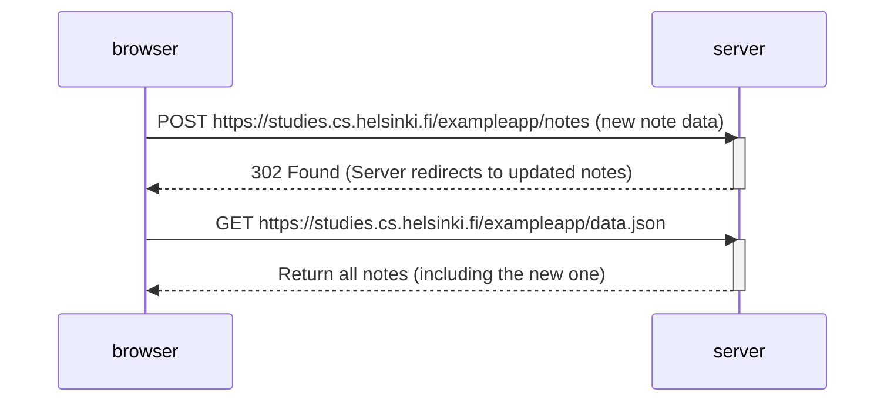

```mermaid
sequenceDiagram
    participant browser
    participant server
    
    
    browser->>server: POST https://studies.cs.helsinki.fi/exampleapp/notes (new note data)
    activate server
    
    server-->>browser: 302 Found (Server redirects to updated notes)
    deactivate server
    
    browser->>server: GET https://studies.cs.helsinki.fi/exampleapp/data.json
    activate server
    server-->>browser: Return all notes (including the new one)
    deactivate server
```
